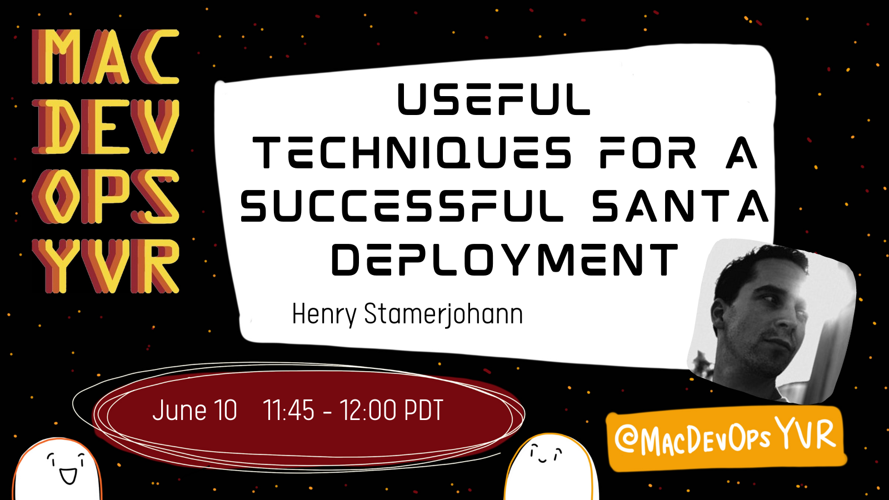

# Virtual MDOYVR21 - slides and extra links

Welcome, here you'll find the slides and complementary info about our MDOYVR 2021 talk.

<https://mdoyvr.com/speakers-2021/>

##### **Virtual MDOYVR21 ** - stream date: 2021-06-11 20:45 MESZ / 11:45 PDT (UTC -7):

### _"Useful techniques for a successful Santa deployment"_

- Find the MDOYVR 2021 session on YouTube [here](https://www.youtube.com/channel/UCIZgKKNrG-ty72Bez8b2qHg)
- Download our MDOYVR21 session slides [here](./pdf/MDOYVR21_santa_deployment.pdf).

## Who are we ?

We are [Zentral Pro Services](https://www.zentral.pro/) - a consulting, research and development company.
We help clients unleash the potential of their Apple devices in a business environment.

We build [Zentral opensource](https://github.com/zentralopensource/zentral/zentral).
We have created [IDent](https://www.ident.help) as a custom solution to improve identity provisioning to enterprise needs in a distributed fleet of Macs.

## Links

- Santa Documentation - <https://santa.readthedocs.io>
- Zentral Documentation - <https://docs.zentral.io>
- Santa project - <https://github.com/google/santa> 
- Zentral open source project - <https://github.com/zentralopensource/zentral>
- Moroz open source project - <https://github.com/groob/moroz>

---

## Workshop

- Link to the Zentral Workshop 2021-06-09 [here](https://www.youtube.com/watch?v=1clfgMV0qSg&t=1462s)

## Tools

- `jq` <https://stedolan.github.io/jq/>
- `yq` - <https://github.com/mikefarah/yq>
